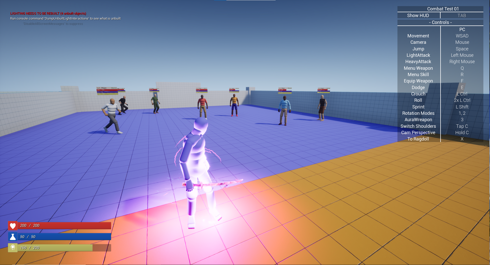
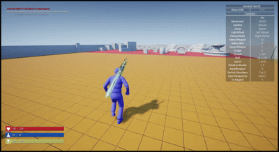
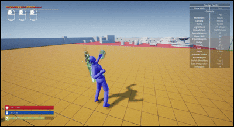
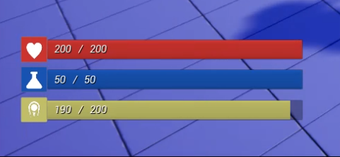

# Combat Engineer Test 1 – Quang Luân
> **Genre:** Action · **Engine:** Unreal Engine 5.6

   
  

## Features

### Combat System – Melee Combo

#### Unarmed (Bare-handed)
- **Ground Combo**

  

- **In-Air Combo**

  

- **Crouching Combo**

  

#### Weapon Combos
- **[Sword] Ground Combo**

  
  

- **[Sword] In-Air Combo**

  
  

### Shared Mechanics
- **HitTrace (animation-driven hit window)**

  

- **Finisher when enemy HP < 40%**

  

- **DoT – Damage Over Time**

  

### Gameplay Ability System
- **Core Attributes: HP & Stamina**

  

### Gameplay
- **Combat Showcase**

  
  

## 🕹️ Demo / Download
- Build: [Google Drive](https://drive.google.com/file/d/1TefWN_s1Il9eK1bO3a5Xf9nug9p1_7eU/view/)